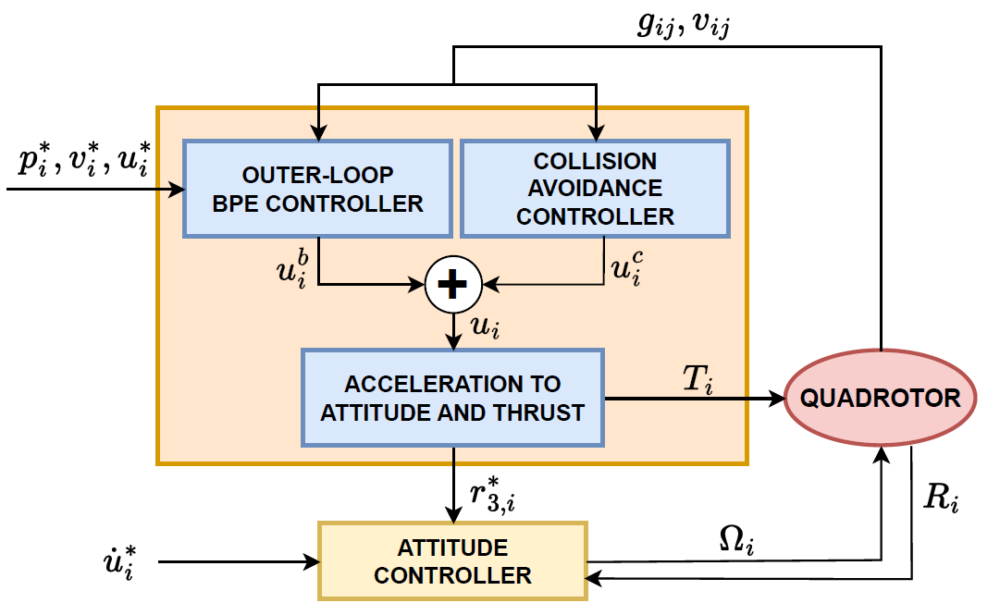

# Leader-follower formation tracking control of quadrotor UAVs using bearing measurements

This repository was used to perform the experiments discussed in "Leader-follower formation tracking control of quadrotor UAVs using bearing measurements". 
The theory in this paper concerns the formation tracking problem of a group of quadrotor UAVs under a limited sensing graph topology.
Agents only have access to bearing measurements, as well as relative velocity with respect to other agents.
Besides that, they have access to their own attitude.
Using persistence of excitation, as little as one neighbor is required for each follower drone to still attain the desired formation.


The used control structure is given below.


## Paper abstract
This work addresses the practical problem of distributed formation tracking control of a group of quadrotor vehicles in a relaxed sensing graph topology with a very limited sensor set, where only one leader vehicle can access the global position. Other vehicles in the formation are assumed to only have access to inter-agent bearing (direction) measurements and relative velocities with respect to their neighbor agents. A hierarchical control architecture is adopted for each quadrotor, combining a high-gain attitude inner-loop and an outer-loop bearing-based formation controller with collision avoidance augmentation. The proposed method enables a group of quadrotors to track arbitrary bearing persistently exciting trajectories, including time-varying shapes and rotational maneuvers, such that each quadrotor only requires relative measurements to as little as one neighboring quadrotor. The effective performance of the control strategy is validated by numerical simulations in MATLAB and real-world experiments with three quadrotors.

## Numerical results
The convergence of the system from numerical simulations in MATLAB can be seen in the figure below, where each following drone only has one neighboring agent, and where the formation shape is rescaled to fit through a window.


## Experimental results
A video of an experiment performed using this repository can be found at [youtu.be/-cPlcVHDzzU](https://youtu.be/-cPlcVHDzzU).

## Installation
This repository relies on the [Pegasus GNC project](https://pegasusresearch.github.io/pegasus/index.html).
For the installation of this simulator environment, see [https://pegasusresearch.github.io/pegasus/source/setup/installation.html](https://pegasusresearch.github.io/pegasus/source/setup/installation.html)

If the Pegasus GNC project is installed, the following commands can be executed to perform a simulation:

```
cd ~
mkdir pegasus
cd pegasus
git clone https://github.com/SDoodeman/bpe_controller.git src
colcon build --symlink-install
source ~/pegasus/install/setup.bash
```

Then, in one terminal run

```
ros2 launch bpe sim.launch.py
```

(in case of a real experiment, run `ros2 launch bpe real.launch.py`)

And in another terminal, run

```
ros2 run bpe_missions mission
```
